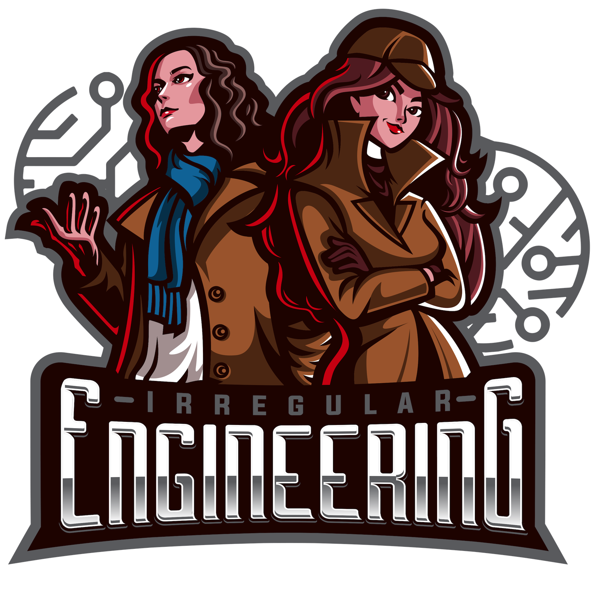

# Imminent Domain Examples

Here are a set of examples built on Next.js that should happily deploy to Vercel.
The intention is to demonstrate the sorts of things you can do with Imminent Domain.

# Getting Started

## Run Locally

First, cd into the example's directory you'd like to run. For example:

```bash
cd basic-api
```

Then run the development server:

```bash
npm run dev
# or
yarn dev
```

Open [http://localhost:3000](http://localhost:3000) with your browser to see the result.

## Deploy to Vercel

The easiest way to deploy your Next.js app is to use the [Vercel Platform](https://vercel.com/import?utm_medium=default-template&filter=next.js&utm_source=create-next-app&utm_campaign=create-next-app-readme) from the creators of Next.js.

At some point, we'll put links to make this trivially easy in all the example directories.

# What is Imminent Domain?

<p align="center">
  
</p>

Imminent Domain (ImmDom) is an Open Source, community-run software platform.
Our purpose is to accelerate software product development with the sole KPI (key performance indicator)
of Time From Idea to MVP (well - you can argue "time to iteration step" more broadly. work with me, people!)

To accomplish this goal, we curate best of breed tech and build our own where it's needed.

The Foundation Project (forthcoming) has focused around rapid infrastructure build out,
centered around enabling technologies like AWS/GCP and Terraform. We also provide
tutorials and educational materials such as these examples.

# Other Things

## Wish List

We welcome your thoughts on how to achieve our state goal, as well as your contributions.

Please use Github Issues to request additional examples, features, or to file bugs.
We'd also love to showcase community examples. We won't bite - promise!

## Catalogue of Examples

Links to the projects will go here. Later we'll make this a webapp itself!

## Sponsors

(not really sponsored by but the logo is cool - and we are looking for people to help us spread the news!)


